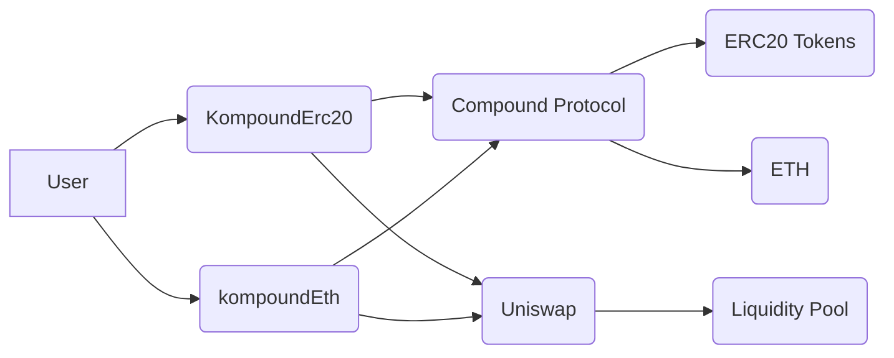
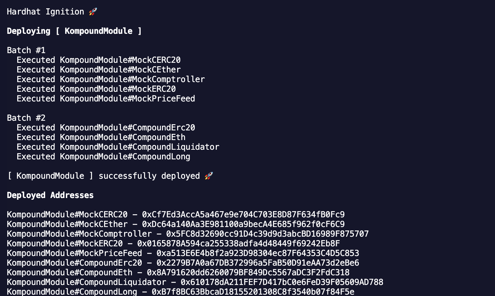

# Kompound

Kompound is a smart contract project that enables users to interact with the Compound protocol for lending and borrowing assets. It supports both ERC20 tokens and ETH, and implements a "long" strategy. The project also includes liquidation functionality.

## Architectural Overview

The Kompound project is designed with a modular architecture, comprising several smart contracts that interact with each other and with external protocols like Compound and Uniswap. The core contracts handle lending, borrowing, and liquidation functionalities, while interfaces define the interactions with external protocols.





To deploy the contracts on a Hardhat node, follow these steps:

1.  Start a Hardhat node:

    ```shell
    npx hardhat node
    ```

2.  Deploy the contracts using Hardhat Ignition, specifying the network as `localhost`:

    ```shell
    npx hardhat ignition deploy ./ignition/modules/KompoundModule.ts --network localhost
    ```

## Contracts

- `KompoundErc20.sol`: Handles interactions with ERC20 tokens in the Compound protocol.
- `kompoundEth.sol`: Handles interactions with ETH in the Compound protocol.
- `KompoundLong.sol`: Implements a "long" strategy within the Compound protocol.
- `KompoundLiquidate.sol`: Handles liquidation events within the Compound protocol.

## Interfaces

- `IERC20.sol`: Standard ERC20 interface.
- `compound/`: Interfaces for interacting with the Compound protocol's core contracts (CErc20, CEth, Comptroller).
- `uniswap/`: Interfaces for interacting with Uniswap V2 (Factory, Pair, Router).

## Mocks

- `MockCERC20.sol`, `MockCEther.sol`, `MockComptroller.sol`, `MockERC20.sol`, `MockPriceFeed.sol`: Mock contracts for testing purposes.

## Ignition Modules

- `KompoundModule.ts`: Hardhat Ignition module for deploying the Kompound contracts.
- `MainnetKompoundModule.ts`: Hardhat Ignition module for deploying the Kompound contracts on mainnet.

## Getting Started

To get started with the project, follow these steps:

1.  Clone the repository:

    ```shell
    git clone <repository_url>
    ```

2.  Install the dependencies:

    ```shell
    yarn install
    ```

3.  Compile the contracts:

    ```shell
    npx hardhat compile
    ```

4.  Run the tests:

    ```shell
    npx hardhat test
    ```

5.  Deploy the contracts using Hardhat Ignition:

    ```shell
    npx hardhat ignition deploy ./ignition/modules/KompoundModule.ts
    ```

## License

This project is licensed under the MIT License - see the [LICENSE](LICENSE) file for details.
